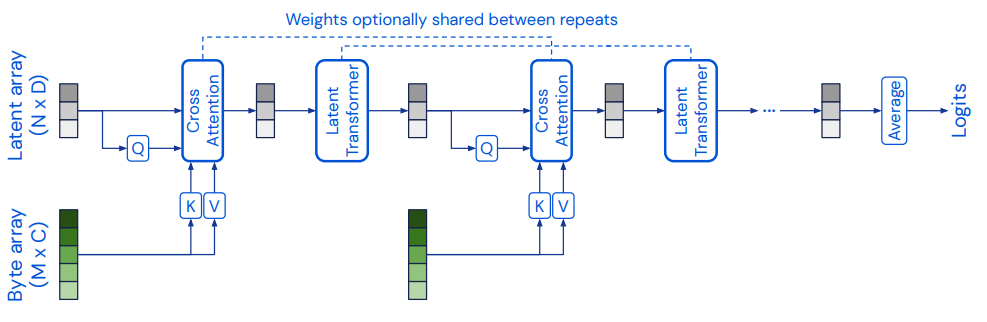
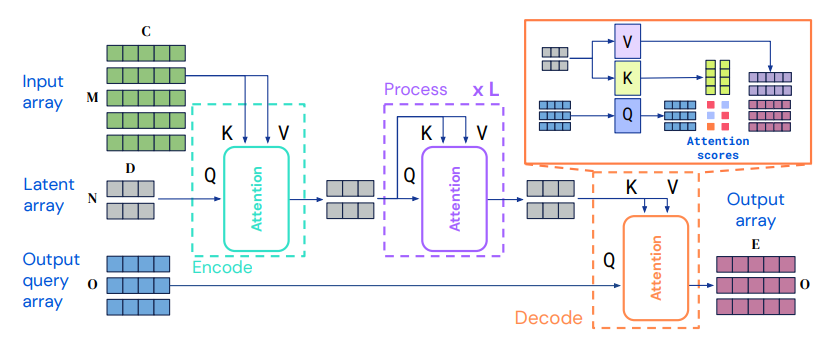

FlashPerceiver
=========================

Fast and memory efficient PyTorch implementation of the Perceiver [1, 2, 3] architecture with FlashAttention [4, 5] as attention backbone.

**Features:**

* :zap: **More than 2x speedup over naive implementation.**
* :zap: **Sub-linear<sup>1</sup> memory usage with respect to input sequence length and linear usage with respect to number of latent vectors.**
* :zap: **Out-of-the-box support for rotary positional embeddings [6]**
* :zap: **Uses the new and improved FlashAttention-2 implementation**
* :zap: **Supports for multiple inputs and flexible masking**

<sup>1</sup> For the attention components. See [Performance](#performance) for more information.

Installation
------------

**Note:** The `pyproject.toml` has recently been removed from the flash-attn repository and so did the PEP 517 compliance. This means that the flash-attn cannot be declared as dependency for this project anymore and thus needs to be manually until the situation changes in the future:

```bash
pip install flash-attn --no-build-isolation
```

Afterwards, install the actual `flash-perceiver` package:


```bash
pip install flash-perceiver
```

Usage
-----

### Perceiver



```python
import torch

from flash_perceiver import Perceiver, utils

batch_size, seq_len, in_dim = 32, 128, 256

latent_dim = 512
num_latents = 512
out_dim = 128

model = Perceiver(
    input_dim=in_dim,
    depth=8,
    output_dim=out_dim,
    num_latents=num_latents,
    latent_dim=latent_dim,
    cross_heads=1,
    cross_head_dim=64,
    cross_rotary_emb_dim=0,
    cross_attn_dropout=0.0,
    latent_heads=8,
    latent_head_dim=64,
    latent_rotary_emb_dim=0,
    latent_attn_dropout=0.0,
    weight_tie_layers=False,
    gated_mlp=True,
    self_per_cross_attn=1,
    use_flash_attn=True,
).cuda()

data = torch.randn(batch_size, seq_len, in_dim, device='cuda')

# `out_dim` specified; averages and projects output
# Note: FlashAttention only supports half-precision.
#  We need to use `torch.autocast` for the forward-pass
with torch.autocast('cuda'):
    out = model(data)

assert out.shape == (32, out_dim)
```

**Multiple inputs**

A separate input for each cross-attention block can be used by providing a list of inputs to the `forward` method. The number of inputs must correspond to the `depth` configuration of the model.

By providing a list of integers to the `input_dim` argument in the constructor, each input can be configured to have a different dimension.

```python
input_dims = [256, 512]

model = Perceiver(
    input_dim=input_dims,
    depth=2,  # must equal len(input_dim)
).cuda()

inputs = [
    torch.randn(batch_size, seq_len, in_dim, device='cuda')
    for in_dim in input_dims
]

with torch.autocast('cuda'):
    out = model(inputs)

assert out.shape == (batch_size, num_latents, latent_dim)
```

**Masking**

A boolean element-wise mask for the input can be provided. All non-True elements will be masked out within the cross-attention operation. If a list of inputs is provided, a list of masks for each input can be provided as well. This can also include `None` values for inputs without a mask.

```python
mask = utils.random_mask(data)  # [batch_size, seq_len]

with torch.autocast('cuda'):
    out = model(data, mask=mask)
```

**Extract Embeddings**

If a value for `output_dim` has been provided to the constructor, the final latent vectors will be averaged and then projected to the desired dimension. To extract the representations prior to the projecting step, set `return_embeddings=True`:

```python
with torch.autocast('cuda'):
    embeds = model(data, return_embeddings=True)

assert embeds.shape == (32, num_latents, latent_dim)
```

**Custom Latents**

For some applications it can be useful to have custom sets of latent vectors. For instance, for a multi-task setting, each task could have a separate set of learned latents.

The `forward` method supports custom latents via the `latents` argument. If not explicitly provided, the module's latent vectors will be used, otherwise the provided ones. These must have shape `[m, latent_dim]` or `[batch_size, n, latent_dim]` where $m$ can be arbitrary.

To disable initializing random latent vectors as part of the model construction, pass `num_latents=None` to the constructor.

**Extract Attention Weights**

> :warning: This is an experimental feature and requires a modified implementation of FlashAttention, [unless the changes are eventually merged](https://github.com/Dao-AILab/flash-attention/pull/589).

`return_attn_weights=True` can be passed to the `forward` method of a model to extract the normalized attention weights of each attention layer. A tuple of `(output, attn_weights)` will be returned in this case, where `attn_weights` is a list with one tensor per attention layer. This list follows the pattern `[cross_attn_0, self_attn_0_0, ..., cross_attn_1, self_attn_1_0]` where attention maps for cross-attention layers will have shape `(batch_size, cross_heads, num_latents, seq_len)` and self-attention maps have shape `(batch_size, latent_heads, num_latents, num_latents)`.

```python
with torch.autocast('cuda'):
    out, all_attn_weights = model(data, return_attn_weights=True)

for i, attn_weights in enumerate(all_attn_weights):
    if i % model.num_attention_layers_per_block == 0:
        print('cross-attention map with shape', attn_weights.shape)
    else:
        print('self-attention map with shape', attn_weights.shape)

```


### PerceiverIO

The [PerceiverIO](https://arxiv.org/abs/2107.14795) is a variant of the Perceiver architecture where the encoder tower is followed by a decoder module that allows task specific computation of outputs via sets of queries.

This makes the architecture more flexible and can be used for cases such position specific decoding of values or multi-task settings.



```python
import torch

from flash_perceiver import PerceiverIO, utils

batch_size, seq_len, in_dim = 32, 128, 256

depth = 8
latent_dim = 512
num_latents = 512
query_dim = 128
num_queries = 32
proj_dim = 64

model = PerceiverIO(
    input_dim=in_dim,
    query_dim=query_dim,
    depth=depth,
    proj_dim=proj_dim,
    num_latents=num_latents,
    latent_dim=latent_dim,
    cross_heads=1,
    cross_head_dim=64,
    cross_rotary_emb_dim=0,
    cross_attn_dropout=0.0,
    latent_heads=8,
    latent_head_dim=64,
    latent_rotary_emb_dim=0,
    latent_attn_dropout=0.0,
    query_heads=1,
    query_head_dim=64,
    query_rotary_emb_dim=0,
    query_attn_dropout=0.0,
    weight_tie_layers=False,
    gated_mlp=True,
    use_flash_attn=True,
).cuda()

data = torch.randn(batch_size, seq_len, in_dim, device='cuda')

# Can be learned or correspond to positions, tokens, etc.
queries = torch.randn(num_queries, query_dim, device='cuda')

with torch.autocast('cuda'):
    out = model(data, queries=queries)

assert out.shape == (batch_size, num_queries, proj_dim)
```

Examples
--------

Other usage examples are provided in the `examples/` folder.

Performance
-----------

The Perceiver is already designed and intended as an attention architecture with sub-quadratic compute and memory complexity in comparison to the quadratic requirements of a vanilla Transformer.

A naive implementation will have $\mathcal{O}(nm)$ memory usage for the cross-attention modules and $\mathcal{O}(n^2)$ complexity for the self-attention or _latent_ blocks, where $n$ the number of input elements , $m$ the number of latent vectors (fixed hyperparameter) and $n \gg m$ should generally apply.

FlashAttention can reduce the memory usage to $\mathcal{O}(\sqrt{nm})$ for the cross-attention layers and $\mathcal{O}(m)$ for the latent self-attention layers. However, this only accounts for the computation of the attention mechanism. The input sequence and corresponding keys and values within the cross-attention modules will still grow with $n$.

Until the latter starts to dominate memory usage, this implementation allows to greatly scale the input sequence length. For instance, 16x larger input lengths can be achieved in comparison to [perceiver-pytorch](https://github.com/lucidrains/perceiver-pytorch) on a RTX 4090, keeping the other hyperparameters fixed (see `run_benchmarks.py` for the exact configuration).

### Benchmarks

Benchmarks against other implementations (currently only [perceiver-pytorch]([perceiver-pytorch](https://github.com/lucidrains/perceiver-pytorch)) can be performed with:

```bash
python run_benchmarks.py
```

The script will create a `benchmark_results.csv`. The `create_plots.py` script can then be used to create plots.

The following data has been obtained with a RTX 4090 and 24GB of VRAM.


**Note:** The batch size for each configuration corresponds to the smallest value that works for all implementations. Especially for longer sequence lengths, this leads to decreasing GPU utilization and thus a lower speedup than theoretically possible. There are some ways to fix this, but my attempts so far have led to distorted results.

Acknowledgements
----------------

The implementation is inspired by lucidrain's [Perceiver implementation](https://github.com/lucidrains/perceiver-pytorch) and would not have been possible without Tri Dao's [FlashAttention](https://github.com/Dao-AILab/flash-attention).

Planned features
---------------

These are a few features that are either planned or WIP. If you have urgent demand for some of them, feel free to write an issue:

- [X] Perceiver IO [2]
- [ ] Perceiver AR [3] (or an AR demo in general)
- [X] Demos
- [X] Tests (see `tests/`)
- [X] Allow more flexible cross-attention configurations
- [ ] Benchmarks against other Perceiver implementations, e.g. [DeepMind's](https://github.com/deepmind/deepmind-research/tree/master/perceiver) or [Krasser's](https://github.com/krasserm/perceiver-io)
- [ ] If FA2 is eventuelly merged into PyTorch, drop the flash-attn dependency
- [ ] Configure and provide multiple inputs as dict
- [ ] TensorDict / tensorclass inputs
- [X] Extract attention weights

References
----------

[1] Jaegle, Andrew, Felix Gimeno, Andrew Brock, Andrew Zisserman, Oriol Vinyals, and Joao Carreira. “Perceiver: General Perception with Iterative Attention.” arXiv, June 22, 2021. http://arxiv.org/abs/2103.03206.

[2] Jaegle, Andrew, Sebastian Borgeaud, Jean-Baptiste Alayrac, Carl Doersch, Catalin Ionescu, David Ding, Skanda Koppula, et al. “Perceiver IO: A General Architecture for Structured Inputs & Outputs.” arXiv, March 15, 2022. http://arxiv.org/abs/2107.14795.

[3] Hawthorne, Curtis, Andrew Jaegle, Cătălina Cangea, Sebastian Borgeaud, Charlie Nash, Mateusz Malinowski, Sander Dieleman, et al. “General-Purpose, Long-Context Autoregressive Modeling with Perceiver AR.” arXiv, June 14, 2022. http://arxiv.org/abs/2202.07765.

[4] Dao, Tri, Daniel Y. Fu, Stefano Ermon, Atri Rudra, and Christopher Ré. “FlashAttention: Fast and Memory-Efficient Exact Attention with IO-Awareness.” arXiv, June 23, 2022. https://doi.org/10.48550/arXiv.2205.14135.

[5] Dao, Tri. “FlashAttention-2: Faster Attention with Better Parallelism and Work Partitioning.” arXiv, July 17, 2023. https://doi.org/10.48550/arXiv.2307.08691.

[6] Su, Jianlin, Yu Lu, Shengfeng Pan, Ahmed Murtadha, Bo Wen, and Yunfeng Liu. “RoFormer: Enhanced Transformer with Rotary Position Embedding.” arXiv, August 8, 2022. https://doi.org/10.48550/arXiv.2104.09864.
